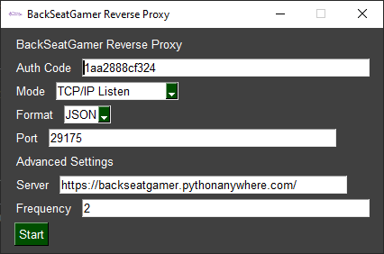

# ReverseProxy
This application is the reverse proxy to relay requests from the main server to the mod

## Running
To run, simply run `ReverseProxy.exe` (or `BackSeatGamerReverseProxy.py` if you are running from source). You will then be greeted with the following interface:



The auth code is the code listed on your session page of BackSeatGamer. The mode and format are specified by the mod creator. If you are a mod creator, see the Development section for more details on each option. The standard port is `8080`. The advanced options should be left as they are.

By clicking `Start`, you may be asked for additional information. If you are, enter the settings as defined by the mod creator. Finally, you will be greeted with the following interface:


When you reach this screen, everything is connected and configured properly between the reverse proxy and the BackSeatGamer Server. If you see an error message indicating a connection error, be sure the game is running. Click OK to retry. If the error persists, try opening a game save file (or create a new game save) and click OK. Some games do not load mods on the menu screens.

This interface is an example from a OpenRCT2 mod. The buttons along the right-hand side will not be the same in all cases. 

The large box on the left side of the screen is the event log. Each time a reward is redeemed, an entry will be added. You can click the `Clear` button at the bottom of the screen to clear the log.

Beside the `Clear` button is the `Stop` button. Clicking this will stop the server from running (if applicable) and return you to the main interface where you can begin a new session.

The right-hand side of the screen contains a button for each possible reward. Clicking on the button will manually trigger it as a user under the name `ManualTrigger`. Triggering this way will bypass any cool-downs configured server side, and has no need for points. Even rewards which are disabled will be listed here.

Finally, the text box allows you to trigger a reward manually if you know the code of the reward. Click "Execute" to run the command. This should only be used if you know what you are doing (and for testing purposes) as this may (but should not) result in the mod crashing if the command does not exist.

Thank you for using the Reverse Proxy (The recommended way to interact with BackSeatGamer). If you encounter any issues or have suggestions, please refer to our [Issue Tracker](https://github.com/BackSeatGamerCode/ReverseProxy/issues).

## Development
This section outlines additional details for integrating the ReverseProxy in your mod. Setup instructions remain the same as Usage. Note that port 8080 should be used by convention unless you specify otherwise in your mod description. Ideally the user should have the option to set the port (be it through an interface or even a config file), but that is ultimately up to you as the mod creator

### Modes
The following is a list of available modes and a description of each. More will be added in the future. If you would like to request a new mode, you may do so in the [Issue Tracker](https://github.com/BackSeatGamerCode/ReverseProxy/issues).

- **TCP/IP Broadcast**: This mode sends a TCP/IP message containing reward information to a TCP/IP server hosted at 127.0.0.1:8080 (or which ever port the user specified on the first screen). In this implementation, you as the mod creator are responsible for creating the TCP/IP server. This, like all other broadcast modes, is the implementation with the least latency.
- **TCP/IP Listen**: This mode creates a TCP/IP server hosted at the broadcast address (0.0.0.0) on th port specified by the user on the first screen. You as the mod creator will need to poll the server every few seconds to get the latest message. There is no rate limit, so feel free to go as frequently as you wish, but not too frequently that it consumes too many resources. Every 1-2 seconds will suffice in most cases. The TCP/IP server is also capable of handling multiple clients at the same time. Each client will be handled separately and will have the opportunity to poll all rewards which the proxy receives from the server.
- **UDP Broadcast**: This mode creates a UDP client which will send a UDP datagram to 127.0.0.1:8080 (or which ever port the user specified on the first screen) containing reward information. In this implementation, the mod creator is responsible for setting up a client capable of receiving UDP datagrams. This, like all other broadcast modes, is the implementation with the least latency.
- **HTTP Listen**: This mode creates an HTTP server hosted at the broadcast address (0.0.0.0) on the port specified by the user on the first screen. Simply poll the root route (http://127.0.0.1:8080/). `GET`, `POST`, `PUT`, `PATCH`, and `DELETE` requests are supported, however, `POST` is recommended, and `PATCH` is NOT recommended as it is not supported by all HTTP request dispatchers. You as the mod creator will need to poll the server every few seconds to get the latest message. There is no rate limit, so feel free to go as frequently as you wish, but not too frequently that it consumes too many resources. Every 1-2 seconds will suffice in most cases. 
- **HTTP Broadcast**: This mode creates an HTTP client which will send an HTTP request to 127.0.0.1:8080 (or which ever port the user specified on the first screen) containing reward information. In this implementation, the mod creator is responsible for setting up a client capable of receiving UDP datagrams. The endpoint can be any endpoint, and should be listed in the mod docs. Only the endpoint is needed (example: `/message`) and not the full URL as the port may vary. This, like all other broadcast modes, is the implementation with the least latency, however, HTTP requests are generally slower than TCP/IP and UDP, so this should be used if TCP/IP and UDP can not be used. 
- **Write To File**: This mode requires the user to provide a path to a directory. Each time a new reward comes in, a new file will be created in that directory containing the reward details. The name of the file will be the UNIX timestamp with the file extension ".txt" regardless of the format. This mode should be used as a last resort, because if files are not removed fast enough or at all, this could clog up the end user's hard drive.

If you could choose from any of these options, the **TCP/IP Broadcast** or **UDP Broadcast** would be the best options. Following that would be **HTTP Broadcast**, **TCP/IP Listen** or **HTTP Broadcast**. Finally, if none of those work, **Write To File** can be used as the last resort.

### Formats
The following is a list of data formats which could be sent by the proxy. Every format contains the same information, but presented in a different way. Each request will only ever return a single reward, even if there are multiple queued in the proxy. This makes mod development more simple.

In all cases, `guest` is the display name of the guest who triggered the reward. If a reward was triggered through the proxy, the name will be `ManualTrigger`.

#### JSON (JavaScript Object Notation)
```json
{"command": "freeParkEntry", "name": "Free Park Entry (1 min)", "guest": "SomeGuest"}
```

#### XML (eXtensible Markup Language)
```xml
<?xml version="1.0" encoding="UTF-8" ?>
<reward command="freeParkEntry" name="Free Park Entry (1 min)" guest="SomeGuest"/>
```

#### CSV (Comma Seperated Values)
```csv
command,name,guest
freeParkEntry,Free Park Entry (1 min),SomeGuest
```
